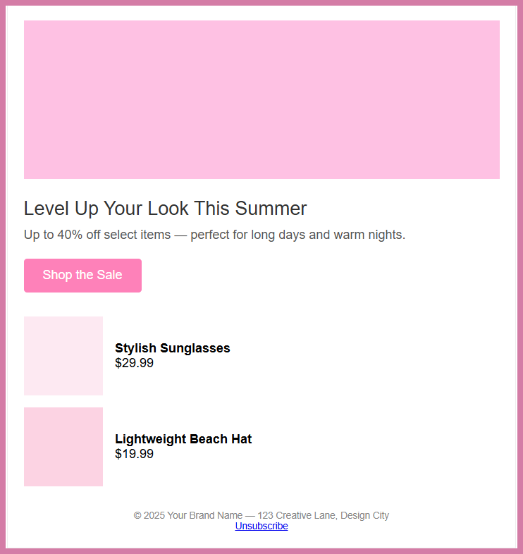

# 🌞 Summer Sale HTML Email

Clean, responsive HTML email built with custom code - no frameworks, no fluff. Just HTML + CSS.  

Designed, built, and tested by me (Lynsie Samani) to showcase layout, spacing, structure, and responsive email formatting.

---

### 🔗 View the Rendered Email
<a href="https://raw.githubusercontent.com/connectwithlynsie/email-summer-sale-project/main/Email_Project_Summer_Sale.html" target="_blank" rel="noopener noreferrer">Click to View Full HTML Email</a>

### 💾 View the Code on GitHub
<a href="https://github.com/connectwithlynsie/email-summer-sale-project" target="_blank" rel="noopener noreferrer">Open Repo</a>

---

### 🖼️ Screenshot Preview

---

### 🧰 Tech Used
- HTML5  
- CSS (inlined + internal)  
- Mobile-first, responsive layout  
- Tested in browser & code playgrounds

---

### 👋 Connect With Me
- <a href="https://www.linkedin.com/in/connectwithlynsie/" target="_blank" rel="noopener noreferrer">LinkedIn</a>  
- <a href="https://github.com/connectwithlynsie" target="_blank" rel="noopener noreferrer">GitHub</a>  
- <a href="https://codepen.io/Lynsie-the-sans" target="_blank" rel="noopener noreferrer">CodePen</a>
